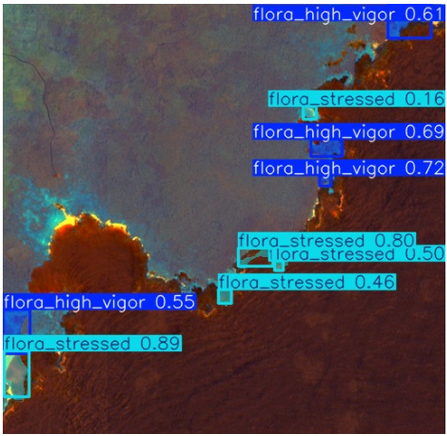

# Pre-Visual Detection of Latent Ecological Stress in Galapagos Flora 🐢🌿

[](https://www.python.org/)
[](https://github.com/ultralytics/ultralytics)
[](https://earthengine.google.com/)
[](#data--weights)

This repository contains the code, models, and data access links for the research project: **"Pre-Visual Detection of Latent Ecological Stress in Galapagos Flora using YOLOv8-Seg and Sentinel-2"**. 

This project operates as an **Autonomous Early Warning System**, utilizing multi-modal deep learning and Red-Edge spectral dynamics to detect physiological stress in endemic vegetation months before it becomes visible to the human eye.

## Scientific Highlights
* **Pre-Visual Detection:** Uses the Normalized Difference Red Edge (NDRE) index to capture chlorophyll depletion prior to visual leaf necrosis.
* **Instance Segmentation:** Implements YOLOv8-Seg to isolate irregular, amorphous vegetative boundaries, filtering out volcanic substrate noise.
* **Longitudinal Climate Tracking:** Quantifies the exact biomass impact (in Hectares) of the El Niño-Southern Oscillation (ENSO), specifically the 2020-2022 La Niña drought and the 2023 El Niño heavy rainfalls.
* **SDG Alignment:** Directly supports the United Nations Sustainable Development Goals 13 (Climate Action) and 15 (Life on Land).

## Repository Structure
* `Galapagos_Flora_Analysis.ipynb`: The master Jupyter Notebook containing the full pipeline (Data extraction, bio-physical tensor engineering, YOLOv8 training, and temporal inference).
* `Biomass_Quantification.csv`: The quantitative results tracking healthy vs. stressed flora in hectares across the 2019-2023 baseline.

## Data & Weights (Open Science)
To support global conservation efforts and ensure computational reproducibility, the curated datasets and optimized model weights are hosted externally.

* **Sentinel-2 Bio-Physical Tensors:** [Download via Google Drive](https://drive.google.com/drive/folders/1a_03d-UL6lMRw9TKnzK4JNIWZjC-bYtZ?usp=sharing)
* **YOLOv8-Seg Trained Weights (`best_v2.pt`):** [Download via Google Drive](https://drive.google.com/drive/folders/1a_03d-UL6lMRw9TKnzK4JNIWZjC-bYtZ?usp=sharing)

## How to Run
We recommend running the master notebook in **Google Colab** to ensure GPU availability for the YOLO inference.

1. Clone this repository:
   ```bash
   git clone https://github.com/ErickOlivo/previsual-stress-detection-galapagos.git
   ```
2. Upload the notebook to Google Colab.
3. Download the weights and dataset from the links above and place them in your Google Drive.
4. Update the path variables in the notebook to point to your Drive folders and run the cells.

## Visual Inference Example

*YOLOv8-Seg spatial inference isolating high-vigor (cyan) and stressed (orange) polygons based on the bio-physical tensor (NDRE/NIR).*

## Author
**Erick Johan Olivo Arturo** | Yachay Tech University  
📧 erick.olivo@yachaytech.edu.ec
